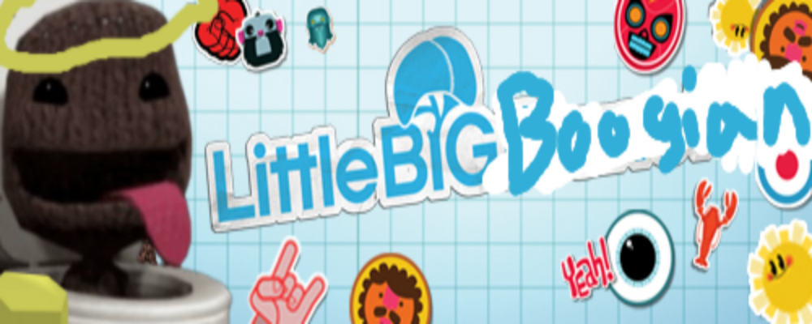

<p align="center">
  
</p>


# Boogian V6.5
Best discord self bot (For fun) :D

This bot is pretty big (Cause of the ai's) Its about 5 gigs

This could work as a discord bot but is not intended (This uses discord.py-self which is a fork of discord-py but for discord self bots.)

**IF YOU ARE GONNA USE THIS PLEASE READ "HOW TO USE" AND DONT TRY TO GET HELP FROM ME!!!!!**
# How to setup

This uses discord.py-self as well as many more python libs so you're gonna need [python](https://www.python.org/) as well as [ollama](ollama.ai) and download llama3 `ollama run llama3.1` (for the ai)

First, we're gonna clone this using this command in terminal (YOU NEED GIT)

```bash
git clone https://github.com/Stabbyiscool/Boogian.git
```

Then, you're gonna wanna change the name of (CHANGEMYNAMETO"configs.json".json) to configs.json and configure it with all of the things u need.

Before we install the libs from 'requirements.txt', let's set up a Python virtual environment. This is important cause it keeps all your project dependencies isolated.

1. Navigate to the project directory:

```bash
cd Boogian
```

2. Set up a virtual environment (you need to have `virtualenv` installed, if not install it via `pip install virtualenv`):

```bash
virtualenv venv
```

3. Activate the virtual environment:

- On Windows:

```bash
venv\Scripts\activate
```

- On macos 🤮 and Linux 👑:

```bash
source venv/bin/activate
```

Now we are gonna install all of the libs from 'requirements.txt'. This is required for the bot to even run. U can do this by:

```bash
pip install -r requirements.txt
```

Once all of that is finished, u can run `main.py` and it SHOULD work fine. U can report issues [here](https://github.com/Stabbyiscool/Boogian/issues)

# Terms of use (TOU)

plz leave a star on the repository

# Testimonies

<p>
  
  
  
  
  
  
  
  
  
  
  
  
  
  
</p>

# Contributors
<a href="https://discord.com/users/627905328075505683"></a>
<a href="https://discord.com/users/1085537701035524187"></a>

thanks :D (Find and patch a bug to get put on the board of contributors!)
